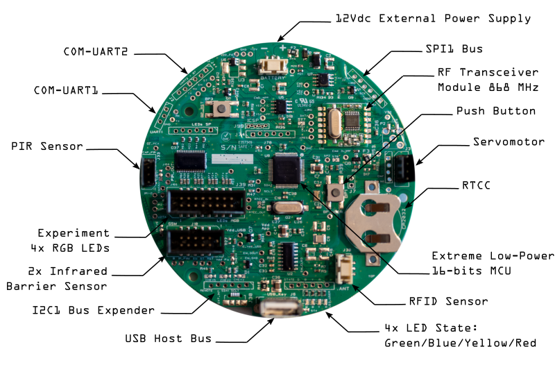

# Electronic development

If you're interested in modifying or extending the OpenFeeder software or hardware, we strongly
suggest discussing your ideas with the developers *before* starting to work on them.
That way you can coordinate with the OpenFeeder Team and others, giving your work a higher chance
of being integrated into the official release.

*Contact [Developer Team](mailto:arnauld.biganzoli@gmail.com)*

https://www.youtube.com/watch?v=hi4DFpqdu0Q&ab_channel=MaximeCauchoix

## The hardware development

Design in 2015 by [Select Design](http://select-design.net/), the last version of OpenFeeder electronic board v03

---

## Credits

OpenFeeder is an open source project ;-)

The OpenFeeder team is composed of [Maxime CAUCHOIX](http://www.iast.fr/member/maxime-cauchoix), [Jérôme BRIOT](http://blog.developpez.com/dut/), [Arnauld BIGANZOLI](http://tonic.inserm.fr/arnauld-biganzoli-404340.kjsp) and [Vincent GUIRAUD](http://select-design.net/).

Join us ;-)

---

## Copyright Notice

This work is licensed under a [Creative Commons Attribution-ShareAlike 4.0 International License](http://creativecommons.org/licenses/by-sa/4.0/).

This means you can use them on your own derived works, in part or completely, as long as you also adopt the same license.
You find the complete text of the license [here](http://creativecommons.org/licenses/by-sa/3.0/legalcode).
